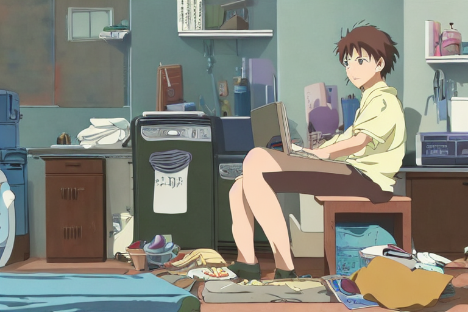

## Prerequisisites

- Nix (with flakes)
- An NVIDIA GPU

## TODOs

- enable CUDA support for pytorch only, to avoid long build times and broken `cupy` package.
- add gradio

## Usage

### Download the weights

Follow the instructions at
https://huggingface.co/CompVis/stable-diffusion-v-1-4-original.

### Setup

Use `--impure` if you need to enable broken packages.

```
nix develop [--impure]
```

Note that it will take a long time to build packages that use CUDA (opencv, torch).

### Creating images

```
python3 optimizedSD/optimized_txt2img.py --H 512 --W 768 --n_iter 1 --n_samples 4 --ddim_steps 50 --prompt "A young man sitting on the floor with his computer, a small messy apartment with dirty laundry and dishes, anime 8K miyasaki ghibli"
```



For further instructions, see:

- https://github.com/basujindal/stable-diffusion
- https://github.com/CompVis/stable-diffusion
